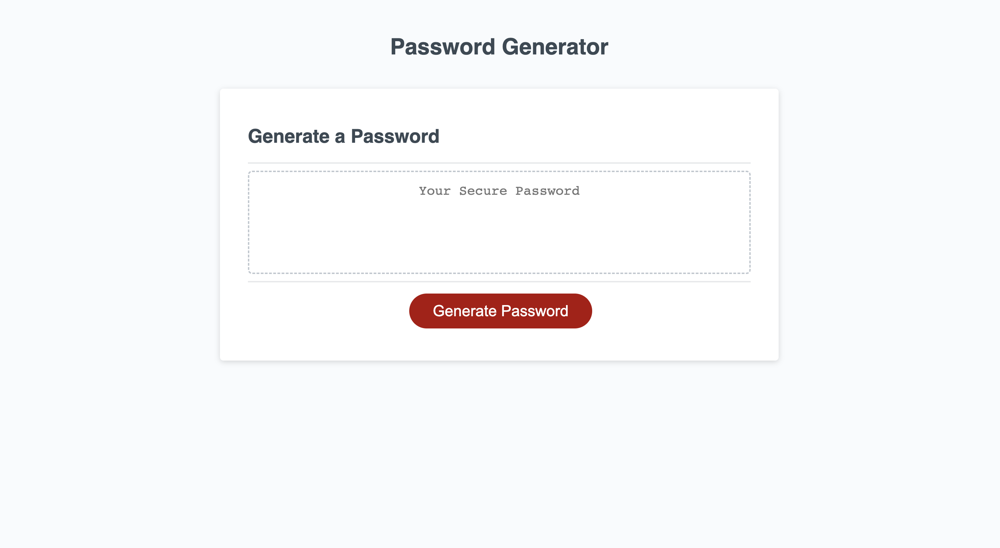

# Challenge 3: Password Generator

## Description 
This week's challenge was to create an application that generates random passwords based on a list of criteria that the user has selected. The criteria included the following:

1. Length of password
2. Special characters
3. Lowercase characters
4. Uppercase characters

For this project, I used JavaScript to generate the password, and used Web API to display the password on to the web browser.

## Installation

N/A

## Usage

[Here is the link to the password generator application.](https://mariea1022.github.io/password-generator/)

Once in the application, to generate a random password, click the button to generate a password. You will then be presented with a series of prompts.
When prompted for password criteria, then select which criteria to include in the password.

Below is the image of the password generator application.

## Credits

N/A

## License

Please refer to the LICENSE in the repo.